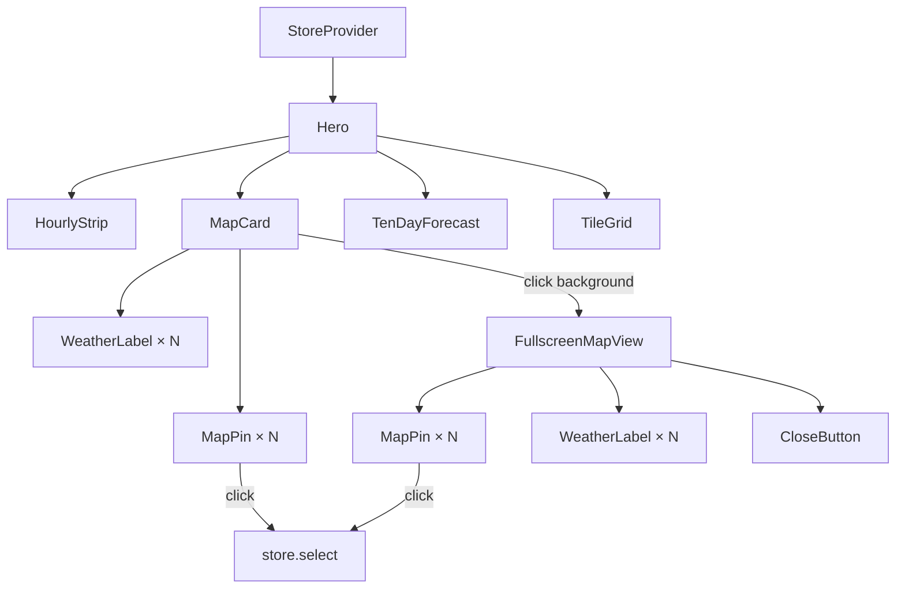

# Design Document: Weather Map Card

## Overview

This feature adds an interactive map card to the Weather Starter dashboard, inspired by Apple Weather's map view. The card renders a Leaflet-based map showing all saved locations as pins with temperature labels. Users can interact with pins to select locations, and expand the card to a fullscreen overlay for a more detailed view.

The project already includes `leaflet` and `react-leaflet` as dependencies. The frontend uses React 18 with a Context-based store (`StoreProvider`), Tailwind CSS for styling, and Vite as the build tool. The existing card pattern (seen in `HourlyStrip`, `TenDayForecast`, `TileGrid`) uses `rounded-2xl border border-white/15 bg-white/[0.08] backdrop-blur-xl` for consistent styling.

## Architecture

The map card integrates into the existing dashboard layout within the `Hero` component, positioned between the `HourlyStrip` and `TenDayForecast` components. It consumes location data from the existing `StoreProvider` context.



**Key architectural decisions:**

1. **Single MapContent component**: Both the compact card and fullscreen view share a `MapContent` component that renders the Leaflet map with pins and labels. This avoids duplicating map logic and ensures consistency (Requirement 4.2).

2. **State from existing store**: The map reads `locations` and `selectedId` from the existing `useStore()` hook. No new state management is needed for location data.

3. **Local UI state for fullscreen**: The fullscreen open/close state is managed locally within the `MapCard` component via `useState`, since it's purely UI state with no need for global access.

4. **Custom markers with DivIcon**: Weather labels are rendered using Leaflet's `DivIcon` to display temperature text above each pin, allowing full CSS control over styling.

## Components and Interfaces

### MapCard

The top-level component rendered in the `Hero` layout.

```typescript
// frontend/src/components/MapCard.tsx

interface MapCardProps {
  // No props needed - reads from store context
}

export function MapCard(): JSX.Element | null;
```

- Renders `null` when `locations` is empty
- Contains the compact 300px-height map view
- Manages fullscreen open/close state
- Handles click-to-expand (clicks on map background, not on pins)

### MapContent

Shared map rendering logic used by both compact and fullscreen views.

```typescript
// frontend/src/components/MapContent.tsx

interface MapContentProps {
  locations: Location[];
  selectedId: number | null;
  onPinClick: (locationId: number) => void;
  isFullscreen?: boolean;
}

export function MapContent(props: MapContentProps): JSX.Element;
```

- Renders `MapContainer` from react-leaflet with OpenStreetMap tiles
- Places one `LocationMarker` per location
- Fits bounds to all markers (with 20px padding) or centers on single location at zoom 13
- Configures `doubleClickZoom={false}` in compact mode
- Configures `minZoom={2}` and `maxZoom={18}` in fullscreen mode

### LocationMarker

Individual map pin with weather label.

```typescript
// frontend/src/components/LocationMarker.tsx

interface LocationMarkerProps {
  location: Location;
  isSelected: boolean;
  onClick: () => void;
}

export function LocationMarker(props: LocationMarkerProps): JSX.Element;
```

- Renders a `Marker` from react-leaflet at `[location.latitude, location.longitude]`
- Uses a custom `DivIcon` that includes the temperature label above the pin
- Selected pin is visually larger (scaled up) to be distinguishable without relying on color alone
- Sets `alt` attribute on marker for accessibility (location area name + temperature)

### FullscreenMapView

Overlay component for the expanded map.

```typescript
// frontend/src/components/FullscreenMapView.tsx

interface FullscreenMapViewProps {
  locations: Location[];
  selectedId: number | null;
  onPinClick: (locationId: number) => void;
  onClose: () => void;
}

export function FullscreenMapView(props: FullscreenMapViewProps): JSX.Element;
```

- Renders a fixed-position overlay covering the full viewport
- Contains `MapContent` in fullscreen mode
- Includes a close button (top-right corner) with accessible label
- Implements focus trap (Tab/Shift+Tab cycle within overlay)
- Listens for Escape key to close
- Prevents body scroll while open
- Has `role="dialog"` and `aria-label="Fullscreen weather map"`
- Returns focus to the MapCard trigger element on close

### BoundsUpdater

A helper component inside the map that adjusts bounds when locations change.

```typescript
// frontend/src/components/BoundsUpdater.tsx

interface BoundsUpdaterProps {
  locations: Location[];
}

export function BoundsUpdater(props: BoundsUpdaterProps): null;
```

- Uses `useMap()` hook from react-leaflet to access the map instance
- Calls `map.fitBounds()` with padding when locations change
- Calls `map.setView()` with zoom 13 when only one location exists

### Utility: formatMapTemperature

```typescript
// frontend/src/components/format.ts (extend existing file)

export function formatMapTemperature(value: number | null | undefined): string;
```

- Returns `Math.round(value) + "°"` for valid numbers
- Returns `"--°"` for null/undefined

## Data Models

No new data models are required. The feature uses the existing `Location` and `WeatherSnapshot` types:

```typescript
// Existing types used by the map card
interface Location {
  id: number;
  latitude: number;
  longitude: number;
  created_at: string;
  weather: WeatherSnapshot;
}

interface WeatherSnapshot {
  temperature_c: number | null;
  area: string | null;
  // ... other fields (not used by map card)
}
```

**Data flow:**
1. `useStore()` provides `locations: Location[]` and `selectedId: number | null`
2. `MapCard` passes locations to `MapContent`
3. Each `LocationMarker` reads `location.latitude`, `location.longitude`, `location.weather.temperature_c`, and `location.weather.area`
4. Pin clicks call `store.select(locationId)` to update the selected location

## Correctness Properties

*A property is a characteristic or behavior that should hold true across all valid executions of a system — essentially, a formal statement about what the system should do. Properties serve as the bridge between human-readable specifications and machine-verifiable correctness guarantees.*

### Property 1: Marker count equals location count

*For any* non-empty array of locations, the MapContent component SHALL render exactly one marker for each location in the array, with each marker positioned at the corresponding location's latitude and longitude.

**Validates: Requirements 1.3, 2.1**

### Property 2: Temperature label formatting

*For any* numeric temperature value, the `formatMapTemperature` function SHALL return the rounded integer followed by a degree symbol (e.g., 25.7 → "26°"). *For any* null or undefined value, it SHALL return "--°".

**Validates: Requirements 3.2, 3.3**

### Property 3: Fullscreen view content consistency

*For any* set of locations, the fullscreen map view SHALL display the same set of markers and weather labels as the compact map card — the marker count, positions, and label text SHALL be identical in both views.

**Validates: Requirements 4.2**

### Property 4: Pin click selects location

*For any* location in the locations array and *for any* map view (compact or fullscreen), clicking that location's pin SHALL result in the store's `selectedId` being updated to that location's id.

**Validates: Requirements 5.1, 5.2**

### Property 5: Accessible name includes location name and temperature

*For any* location with a non-null area name and temperature, the corresponding map pin's accessible name SHALL contain both the area name and the formatted temperature value.

**Validates: Requirements 6.6**

## Error Handling

| Scenario | Handling |
|----------|----------|
| Leaflet tile server unavailable | Map renders with grey tiles; pins and labels still display. No error shown to user (graceful degradation). |
| Location has null coordinates | Should not occur (backend validates), but if encountered, skip rendering that marker. |
| Location has null temperature | Display "--°" as the weather label (Requirement 3.3). |
| Location has null area name | Use formatted coordinates (e.g., "1.350, 103.820") as fallback in accessible name. |
| Fullscreen fails to open | Wrap in try/catch; log error but don't crash the dashboard. |
| react-leaflet throws during render | Wrap MapCard in an error boundary that renders a fallback message. |

## Testing Strategy

### Unit Tests (Example-Based)

Unit tests cover specific scenarios, edge cases, and integration points:

- **Conditional rendering**: MapCard renders when locations exist, doesn't render when empty (1.1, 1.2)
- **Card styling**: Verify correct Tailwind classes are applied (1.4, 1.5)
- **Map configuration**: doubleClickZoom disabled, zoom bounds set correctly (1.6, 4.6)
- **Reactivity**: Adding/removing locations updates markers (2.2, 2.3)
- **Single location**: Centers at zoom 13 (2.5)
- **Label positioning**: Weather labels render above pins (3.1)
- **Fullscreen open/close**: Click background opens, close button closes, Escape closes (4.1, 4.3, 4.4, 4.5)
- **Scroll lock**: Body overflow hidden while fullscreen is open (4.7)
- **Selected pin styling**: Selected pin is visually distinct (5.3)
- **Idempotent selection**: Clicking already-selected pin doesn't change state (5.4)
- **Accessibility attributes**: aria-label on MapCard, role="dialog" on overlay, focus trap, focus restoration (6.1–6.5, 6.7)

### Property-Based Tests

Property tests verify universal properties across randomized inputs using `fast-check`:

- **Property 1**: Generate random arrays of 1–20 locations with random lat/lng, verify marker count matches
- **Property 2**: Generate random numbers (including edge cases like -0, NaN, Infinity) and null/undefined, verify formatting output
- **Property 3**: Generate random location sets, verify both views produce identical marker data
- **Property 4**: Generate random location sets with a random target pin, simulate click, verify selection updates
- **Property 5**: Generate random locations with random area names and temperatures, verify accessible name content

**Configuration:**
- Library: `fast-check` (TypeScript property-based testing library)
- Minimum iterations: 100 per property
- Tag format: `Feature: weather-map-card, Property {number}: {property_text}`

### Test File Structure

```
frontend/src/components/__tests__/
  MapCard.test.tsx          # Unit tests for MapCard rendering and interactions
  MapContent.test.tsx       # Unit tests for map content and markers
  FullscreenMapView.test.tsx # Unit tests for fullscreen overlay behavior
  format.test.ts            # Property tests for formatMapTemperature
  map.property.test.tsx     # Property tests for map marker/label properties
```
